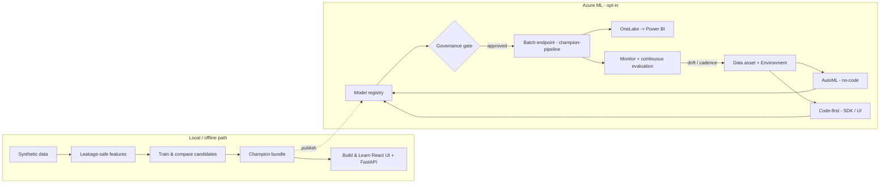
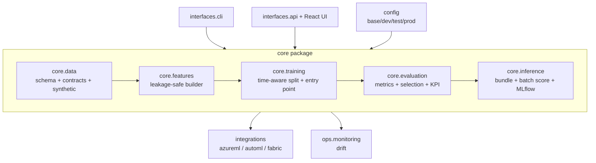
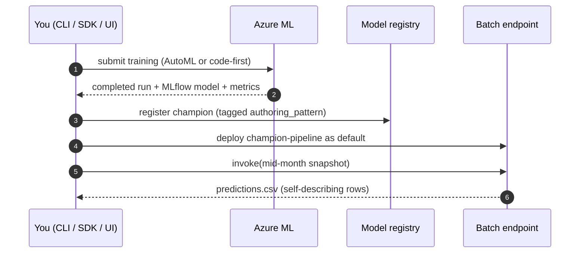

# Revenue Prediction Accelerator

> **Reusable Azure Machine Learning accelerator** for predicting healthcare
> **facility month-end net revenue** from **partial-month** operational and
> financial data.

> [!IMPORTANT]
> **All sample data in this repository is fully synthetic.** It contains no
> customer, patient, or organization-specific information. Every sample output
> is illustrative only and **must be reviewed by qualified finance, data,
> security, privacy, compliance, and operational stakeholders before any
> production use.** This accelerator is **operational decision support and
> financial forecasting** — it is *not* clinical decision support, financial
> advice, an autonomous financial decision-making system, a compliance
> certification, or a production-ready solution without organization-specific
> review.

---

## What this accelerator does

Given **partial-month** data (for example, everything known by **day 15** of an
accounting month), it produces an **early, reliable estimate of month-end net
revenue by facility**. Inference can run repeatedly during the month without
retraining; retraining happens on an approved schedule or when drift,
degradation, schema changes, or upstream-data changes justify it.

The prediction grain is **facility × accounting month × as-of snapshot date**:

| Column | Meaning |
| --- | --- |
| `facility_id` | Neutral facility identifier (e.g. `FAC-001`) |
| `accounting_month` | Accounting month, `YYYY-MM` |
| `snapshot_date` | As-of date within the month, `YYYY-MM-DD` |
| `snapshot_day` | Day of month for the snapshot (7, 10, 12, 15, 18, 21, 24, 27) |

The target is `actual_month_end_net_revenue`, which is only known **after
accounting close**.

## Architecture at a glance

**System view** — offline-first, with an opt-in Azure ML + Fabric path:



**Codebase view** — a layered `src/` package with thin interfaces on top:



**End-to-end sequence** — train once, score many:



Full detail: [docs/architecture/overview.md](docs/architecture/overview.md) and
[docs/architecture/mlops-v2.md](docs/architecture/mlops-v2.md).

## Four purposes, one repository

1. **Reusable, production-oriented accelerator** — src-layout package, MLOps
   assets, secure infrastructure as code, CI/CD.
2. **End-to-end Azure ML + Microsoft Fabric demonstration** — AutoML *and*
   code-first training, OneLake I/O, Power BI-ready output.
3. **Self-guided educational experience** — an original interactive **React**
   experience with a pervasive, in-context learning layer, plus structured docs.
4. **Instructor-led workshop** — exercises, facilitator guide, knowledge checks.

## Two Azure Machine Learning v2 approaches

- **Automated ML** using the Azure Machine Learning Python SDK v2.
- **Code-first ML** using Python, Azure ML SDK v2, MLflow, and appropriate
  **regression and forecasting** techniques (regression-first by design).

## Quickstart (fully offline)

```bash
# 1. Install backend dependencies (creates .venv)
uv sync --extra api

# 2. Generate the synthetic dataset
uv run revenue-prediction generate-data

# 3. Train and compare code-first candidates locally
uv run revenue-prediction train-local

# 4a. Build the React UI and serve it with the API (single URL)
npm --prefix frontend install && npm --prefix frontend run build
uv run revenue-prediction serve            # http://127.0.0.1:8000  (API docs at /docs)

# 4b. …or run the Vite dev server with hot reload (proxies /api to the backend)
uv run revenue-prediction serve --reload   # terminal 1
npm --prefix frontend run dev              # terminal 2 -> http://localhost:5173
```

No Azure or Fabric credentials are required for the offline path. Cloud steps
(AutoML, code-first jobs, registration, endpoints, OneLake, deployment) are
**opt-in** and documented under [`docs/`](docs/).

## Build & Learn app — start & stop

The **Build & Learn** experience is the FastAPI backend serving the built React
UI at a single URL. Two ways to run it:

```bash
# Managed background process (idempotent; logs to .run/ui.log)
scripts/start-ui.sh                 # build UI if needed, then start -> http://127.0.0.1:8000
scripts/stop-ui.sh                  # stop it (by PID file, or by port)
scripts/start-ui.sh --foreground    # run in the foreground (Ctrl+C to stop)
scripts/start-ui.sh --reload        # dev mode (auto-reload)

# …or run the server directly
uv run revenue-prediction serve            # http://127.0.0.1:8000  (API docs at /docs)
```

- **Start:** `scripts/start-ui.sh` builds `frontend/dist` if missing, starts the
  server in the background, waits for `/api/health`, and prints the URL + log path.
- **Stop:** `scripts/stop-ui.sh` terminates the process (PID file first, then the
  listening port as a fallback).
- **Ports/host:** override with `UI_PORT` / `UI_HOST` or `--port` / `--host`.

## Deploy to Azure ML — step by step (opt-in)

Do the offline quickstart first, then add the cloud when you're ready.

**1. Provision a workspace.** Pick a profile in [`infra/`](infra/) (see
[`infra/README.md`](infra/README.md)):

```bash
# Learning / demo (public quickstart) — Bicep
az group create -n <rg> -l eastus2
az deployment group create -g <rg> \
  -f infra/bicep/main.bicep -p infra/bicep/quickstart.bicepparam
# Production-like secure managed-VNet uses infra/terraform/ or the secure Bicep param.
```

**2. Create your `.env`.** Copy the template and fill in **your** values locally
(never commit it — `.env` is git-ignored):

```bash
cp .env.example .env
# Set at least:
#   RPA_AZURE_ML__SUBSCRIPTION_ID=<your-subscription-id>
#   RPA_AZURE_ML__RESOURCE_GROUP=<rg>
#   RPA_AZURE_ML__WORKSPACE_NAME=<workspace>
# Auth uses DefaultAzureCredential — no secrets go in .env.
```

**3. Install the Azure extra and sign in:**

```bash
uv sync --extra azure
az login --tenant <your-tenant>
uv run revenue-prediction info --env dev     # verify config (no secrets printed)
```

**4. Register the data asset and environment** (snippets in
[`notebooks/code_first/`](notebooks/code_first/) and [`notebooks/automl/`](notebooks/automl/)),
then **run your first pattern** (below).

**5. Register -> gate -> deploy -> monitor** using the runbooks:
[deploy/update](docs/operations/runbooks/batch-endpoint-deploy-and-update.md) ·
[promote dev->test->prod](docs/operations/runbooks/promote-across-environments.md) ·
[monitoring + continuous evaluation](docs/operations/monitoring.md).

> Prefer a guided walkthrough? Open the
> [end-to-end notebook](notebooks/end_to_end/00_end_to_end_walkthrough.ipynb) — it
> runs the offline path and shows the opt-in cloud steps in sequence.

## Which pattern should I start with?

There are **four** authoring patterns (AutoML UI/SDK, code-first UI/SDK) that all
produce the **same governed model**. Recommended order:

1. **Start with AutoML (SDK)** — a fast, explainable **benchmark**; establishes a
   WAPE bar with no manual tuning.
2. **Graduate to code-first (SDK)** — the governed **champion** path with explicit
   leakage-safe features, time-aware validation, and full reproducibility.
3. Use the **UI patterns** (AutoML wizard, Designer) for demos and analyst
   self-service.

Details and a side-by-side comparison:
[docs/patterns/model-selection-and-evaluation.md](docs/patterns/model-selection-and-evaluation.md).

## Azure ML workspace at a glance

What you'll see in Azure ML Studio, and where this accelerator's assets live
(full tour: [docs/operations/workspace-tour.md](docs/operations/workspace-tour.md)):

| Section | Key tabs | This accelerator |
| --- | --- | --- |
| **Authoring** | Notebooks · Automated ML · Designer | AutoML wizard (Pattern 1), Designer component (Pattern 4), notebooks |
| **Assets** | Data · Jobs · Components · Models · Endpoints | `revenue_snapshots` data, training/scoring jobs, `revenue-net-revenue-model`, `revenue-batch-endpoint` |
| **Manage** | Compute · Monitoring · Linked Services | `cpu-cluster`, drift monitoring, OneLake/Fabric link |

Reading a run's **Metrics** screen (MAE, RMSE, R², NRMSE, …) is explained in
[docs/modeling/models-and-metrics.md](docs/modeling/models-and-metrics.md#automl-run-metrics-in-azure-ml-studio).

## Where to go next

- **New here?** Run the offline quickstart, then the
  [Build & Learn app](#build--learn-app--start--stop).
- **Understand the design:** [architecture overview](docs/architecture/overview.md) ·
  [MLOps v2 mapping](docs/architecture/mlops-v2.md).
- **Run the demo:** [end-to-end demo script](docs/demo/end-to-end-demo-script.md).
- **Pick a pattern & read metrics:**
  [model selection & evaluation](docs/patterns/model-selection-and-evaluation.md) ·
  [models & metrics](docs/modeling/models-and-metrics.md).
- **Operate it:** [runbooks](docs/operations/runbooks/README.md).

## Repository map

| Path | Purpose |
| --- | --- |
| [`src/revenue_prediction/`](src/revenue_prediction/) | Core Python package, grouped into `core/`, `integrations/`, `interfaces/` (FastAPI backend under `interfaces/api/`) |
| [`frontend/`](frontend/) | React + TypeScript educational UI (Vite) |
| [`configs/`](configs/) | Layered base/dev/test/prod configuration |
| [`data/`](data/) | Synthetic data, contracts, dictionary, provenance |
| [`mlops/`](mlops/) | Components, environments, endpoints, monitoring, schemas |
| [`notebooks/`](notebooks/) | AutoML, code-first, Fabric, responsible AI notebooks |
| [`fabric/`](fabric/) | Fabric notebooks & pipeline guidance |
| [`infra/`](infra/) | Bicep + Terraform (quickstart, secure VNet, BYO VNet) |
| [`docs/`](docs/) | Architecture, deployment, governance, security, workshops |
| [`tests/`](tests/) | unit / contract / smoke / integration / ui tests |

## Documentation index

- **Docs home / table of contents**: [`docs/README.md`](docs/README.md)
- **Full end-to-end demo script** (Azure ML talking track): [`docs/demo/end-to-end-demo-script.md`](docs/demo/end-to-end-demo-script.md)
- Architecture & decisions: [`docs/architecture/`](docs/architecture/)
- **End-to-end patterns** (AutoML UI/SDK, code-first UI/SDK): [`docs/patterns/`](docs/patterns/end-to-end-patterns.md)
- **MLOps v2 mapping**: [`docs/architecture/mlops-v2.md`](docs/architecture/mlops-v2.md)
- **Repository structure** review: [`docs/architecture/repository-structure.md`](docs/architecture/repository-structure.md)
- Modeling strategy & AutoML: [`docs/modeling/`](docs/modeling/)
- Fabric & OneLake: [`docs/fabric/`](docs/fabric/)
- Security & networking: [`docs/security/`](docs/security/)
- Deployment: [`docs/deployment/`](docs/deployment/)
- Governance & responsible AI: [`docs/governance/`](docs/governance/)
- Operations, monitoring, retraining: [`docs/operations/`](docs/operations/)
- **Operational runbooks** (deploy/update, incident/rollback, data refresh): [`docs/operations/runbooks/`](docs/operations/runbooks/README.md)
- Inference in production (runbook): [`docs/operations/inference-in-production.md`](docs/operations/inference-in-production.md)
- Education & workshops: [`docs/education/`](docs/education/), [`docs/workshops/`](docs/workshops/)

## Safety, neutrality, and licensing

- Customer-neutral: neutral identifiers only (`FAC-001`, `WORKSPACE_PLACEHOLDER`,
  `LAKEHOUSE_PLACEHOLDER`). No secrets or resource identifiers are committed.
- Third-party reuse and licensing decisions are recorded in
  [`THIRD_PARTY_NOTICES.md`](THIRD_PARTY_NOTICES.md).
- See [`SECURITY.md`](SECURITY.md), [`SUPPORT.md`](SUPPORT.md),
  [`CONTRIBUTING.md`](CONTRIBUTING.md), and [`CODE_OF_CONDUCT.md`](CODE_OF_CONDUCT.md).

## License

Released under the [MIT License](LICENSE).
