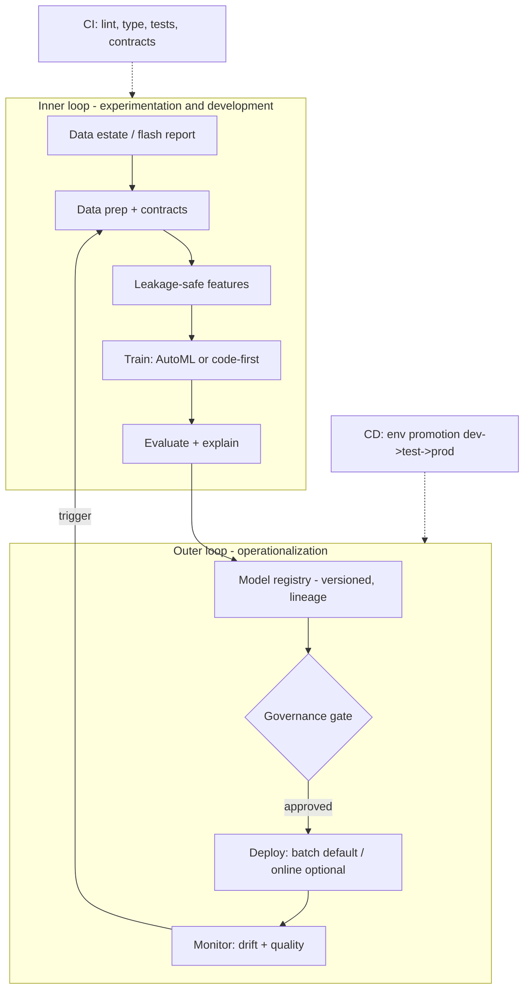
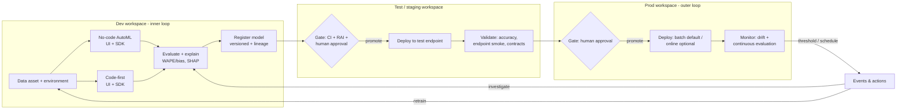

# MLOps v2 mapping (classical ML)

This accelerator implements the Azure Architecture Center **classical machine
learning MLOps v2** pattern. This page maps our components to that reference so
the end-to-end design is explicit.

## The two loops

## Reference architecture — dev → test → prod

This expands the two loops to the **classical machine learning** reference
([Azure Architecture Center](https://learn.microsoft.com/azure/architecture/ai-ml/guide/machine-learning-operations-v2#classical-machine-learning-architecture)),
showing that **both** authoring paths — **no-code AutoML** and **code-first** —
converge on one registered model that is promoted across environments with
human-gated approval, then monitored with drift **and** continuous evaluation.

Environment behavior is driven by the `configs/dev|test|prod` profiles (dataset
size, AutoML budget, model set); cloud identifiers come only from environment
variables. See
[operations/runbooks/promote-across-environments.md](../operations/runbooks/promote-across-environments.md).

## Component mapping

| MLOps v2 element | In this repo |
| --- | --- |
| Data estate / ingestion | Synthetic generator + Fabric/OneLake input ([`src/revenue_prediction/core/data/`](../../src/revenue_prediction/core/data/), [`fabric/`](../../fabric/)) |
| Data prep & validation | Contracts + schema ([`data/contracts/`](../../data/contracts/), `core.data.contracts`) |
| Feature engineering | `core.features.LeakageSafeFeatureBuilder` (fit on train only) |
| Experimentation (inner) | 4 patterns ([patterns](../patterns/end-to-end-patterns.md)): AutoML UI/SDK, code-first UI/SDK |
| Evaluation & explainability | `core.evaluation` (WAPE/bias, by facility/day; permutation + SHAP) |
| Model registry | `integrations.azureml.register_model_from_run` → Azure ML registry |
| Governance gate | Champion/challenger + promotion rule ([governance](../governance/model-governance.md)) |
| Deployment | Batch (default) / online endpoints ([`mlops/endpoints/`](../../mlops/endpoints/)) |
| Monitoring | Drift/quality ([`mlops/monitoring/`](../../mlops/monitoring/), [operations/monitoring.md](../operations/monitoring.md)) |
| Continuous evaluation | Predictions vs post-close actuals ([`mlops/components/continuous_evaluation.yml`](../../mlops/components/continuous_evaluation.yml), `core.evaluation.azureml_evaluate`) |
| Retraining trigger | Scheduled/drift/degradation ([operations/retraining.md](../operations/retraining.md)) |
| CI | [`.github/workflows/ci.yml`](../../.github/workflows/ci.yml) (ruff, pyright, pytest, contracts, neutrality, bicep, frontend) |
| CD / environment promotion | `configs/dev|test|prod` + [deployment](../deployment/guide.md) |
| Infrastructure | Secure workspace ([`infra/`](../../infra/), [security/networking.md](../security/networking.md)) |
| Interactive learning | React Build & Learn UI teaches this exact lifecycle |

## Environments

`dev` → `test` → `prod` config profiles drive the same code across environments.
Promotion is gated by passing CI, disaggregated-accuracy review, the Responsible
AI checklist, and human approval.

## Reference

- Machine learning operations (MLOps) v2 — Azure Architecture Center
  (classical machine learning architecture).
