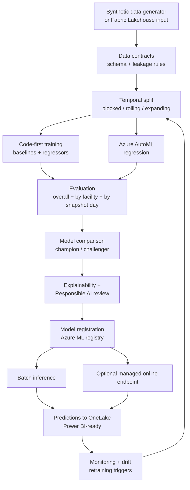

# Architecture overview

## Purpose

Predict **month-end net revenue** per facility from **partial-month** data, at
the grain `facility_id × accounting_month × snapshot_date`. See
[ADR 0001](adr/0001-modeling-grain.md).

## End-to-end flow

## Layers

| Layer | Package | Responsibility |
| --- | --- | --- |
| Configuration | `config` | Layered base/dev/test/prod, env-var overrides, no secrets |
| Data | `data` | Synthetic generation, schema, contracts, leakage rules, IO |
| Features | `features` | Leakage-safe, fit-on-train-only transformer |
| Splitting | `training.splitting` | Time-aware splits and backtest folds |
| Models | `models` | Baselines + regressors + factory |
| Training | `training` | Orchestration + Azure ML entry point |
| AutoML | `automl` | Azure ML SDK v2 AutoML regression |
| Azure ML | `azureml` | Workspace client, command jobs, registration |
| Evaluation | `evaluation` | Metrics, grouped accuracy, selection, explainability |
| Inference | `inference` | Model bundle, batch scoring, uncertainty |
| Fabric | `fabric` | OneLake read/write with local fallback |
| Monitoring | `monitoring` | PSI / drift preparation |
| Security | `security` | Redaction, neutrality scanning |
| Education | `education` | Original lessons and knowledge checks |
| UI | `ui` | Streamlit experience (thin over testable logic) |
| Pipelines | `pipelines` | Offline end-to-end orchestration |

## Environments

`dev`, `test`, and `prod` configuration profiles support progression from local
development through governed promotion. See
[`docs/deployment/`](../deployment/) and [`docs/governance/`](../governance/).

## Security posture

No secrets or resource identifiers are committed. Production deployments use
network isolation and private endpoints; see [`docs/security/`](../security/).
