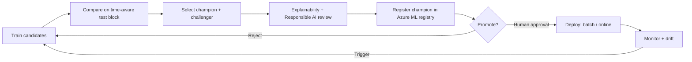

# Model governance

## Lifecycle

## Champion / challenger

- **Champion:** best model on the held-out test block by the configured primary
  metric (`model.primary_metric`, default `mae`).
- **Challenger:** runner-up candidate, or a newly trained model during a
  retraining cycle.
- **Promotion rule:** a challenger is *promotable* only if it beats the incumbent
  by more than `evaluation.challenger_improvement_threshold` (default 2%). This
  prevents promotion on noise. Implemented in
  `revenue_prediction.evaluation.select_champion_challenger`.

## Registration

`revenue_prediction.azureml.register_model_from_run` registers the MLflow model
produced by a training job under `azure_ml.registered_model_name`. Registration
captures lineage (job/run), enabling reproducibility and rollback.

## Environment promotion (dev → test → prod)

- Each environment has its own config profile (`configs/dev|test|prod`).
- Promotion is gated by: passing quality checks, disaggregated accuracy review,
  Responsible AI checklist, and human approval.
- CI runs the offline quality gates on every change; cloud promotion is a
  deliberate, credentialed action (see [`docs/deployment/`](../deployment/)).

## Versioning and rollback

- Models are versioned in the Azure ML registry.
- Prediction outputs carry `model_version` and `run_id`, so any prediction can be
  traced to its exact model.
- Rollback = redeploy a prior registered version.

## Audit trail

- MLflow tracks parameters, metrics, and artifacts for every run.
- Champion selection and the comparison table are logged.
- Data contracts and leakage tests gate every dataset entering training.
