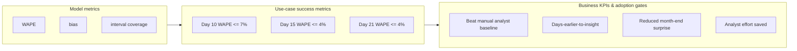

# Success metrics & business KPIs — how to measure the model against the use case

A good WAPE number is not the goal — **a trusted, early, dollar-accurate
month-end estimate that finance acts on** is. This page maps the **model
metrics** to the **use-case success metrics** and **business KPIs**, and shows the
**code** that measures them.

> All data is synthetic; identifiers are placeholders. Targets below are
> illustrative defaults — set your own with finance stakeholders.

## The three layers



- **Model metrics** (`core.evaluation.metrics`): WAPE (dollar-weighted), bias
  (direction), and interval coverage for ensemble models. Reported **overall and
  by facility and by snapshot day** — averages hide problems.
- **Use-case success metrics** (`education.get_metric_targets`): per-checkpoint
  WAPE targets (the mid-month reads finance cares about).
- **Business KPIs & adoption gates** (`education.get_success_criteria`): the
  outcomes that decide whether the POC is adopted.

## Per-checkpoint targets (defaults)

| Checkpoint | Primary metric | Target | Must beat |
| --- | --- | --- | --- |
| Day 10 (early read) | WAPE | ≤ 5–7% (directional) | Manual analyst estimate |
| Day 15 (primary) | WAPE + bias | ≤ 4% system; ±3–5% by facility | Manual analyst estimate |
| Day 21 (second) | WAPE | ≤ 4% | Manual analyst estimate |
| Pre-close (final) | WAPE + interval coverage | ≤ 4%; ~80% coverage | Manual analyst estimate |

Structured, measurable versions live in
[`core.evaluation.kpi.DEFAULT_CHECKPOINT_TARGETS`](../../src/revenue_prediction/core/evaluation/kpi.py);
the narrative versions in
[`education.get_metric_targets`](../../src/revenue_prediction/education/content.py).

## Business KPIs & adoption gates

| Category | KPI / gate | How it's measured |
| --- | --- | --- |
| Business KPI | **Beat manual analyst baseline** | `kpi.beats_baseline(champion_wape, baseline_wape)` |
| Business KPI | Days-earlier-to-insight | Reliable read by day 15 vs. waiting for close |
| Business KPI | Reduced month-end surprise | Shrink mid-month vs. final gap, by facility |
| Business KPI | Analyst effort saved | Fewer hours hand-building estimates |
| Adoption gate | Workflow integration | Predictions auto-populate the Power BI report |
| Adoption gate | Refresh reliability | Predictions land on time each checkpoint |
| Adoption gate | Explainability | Key drivers visible (SHAP / permutation) |
| Adoption gate | Governance sign-off | Aggregate-only, no PHI; access confirmed |

## Measure it — code

### Locally (CLI)

Once a month closes and actuals are known, score predictions against them and
grade against targets and the manual baseline:

```bash
uv run revenue-prediction scorecard predictions.parquet actuals.parquet \
  --baseline-wape 0.08
```

This prints a **KPI scorecard**: per-checkpoint WAPE vs. target (met / not-met
with margin) plus the beat-baseline KPI.

### In Azure ML (continuous evaluation)

The [continuous-evaluation component](../operations/monitoring.md#continuous-evaluation-predictions-vs-actuals)
writes `kpi_scorecard.csv` and logs `kpi_targets_met` (plus `eval_wape`,
`eval_bias`) to MLflow — so you get a **KPI trend per model version** over time:

```bash
az ml component create -f mlops/components/continuous_evaluation.yml -g <rg> -w <workspace>
# schedule monthly after close; compare kpi_targets_met / eval_wape across runs
```

### Programmatically

```python
from revenue_prediction.core.evaluation import (
    compute_metrics, metrics_by_snapshot_day, kpi_scorecard,
)

overall = compute_metrics(y_true, y_pred)
by_day = metrics_by_snapshot_day(frame, "actual_month_end_net_revenue",
                                 "predicted_month_end_net_revenue")
scorecard = kpi_scorecard(overall, by_day, baseline_wape=0.08)
# scorecard: checkpoint, snapshot_day, metric, value, target, met, margin
```

## From metric to decision

- **Promotion gate:** a model is promotable only if it clears the day-15 target
  **and** beats the manual baseline (the trust threshold), then passes the
  Responsible AI review and human approval — see
  [governance/model-governance.md](../governance/model-governance.md).
- **Retraining trigger:** when continuous evaluation shows `eval_wape` rising
  above target for sustained windows, retrain — see
  [operations/retraining.md](../operations/retraining.md).

## Related

- [Model selection & evaluation across the four patterns](../patterns/model-selection-and-evaluation.md)
- [Monitoring & continuous evaluation](../operations/monitoring.md)
- [Responsible AI](../governance/responsible-ai.md)
