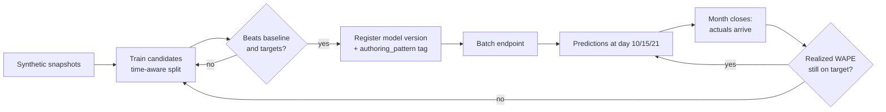

# End-to-end lifecycle: inner loop, outer loop, and observability

This guide explains **what the training results mean**, **when a model is ready
to promote**, **how to score new data**, and **what changes inside a managed
VNet**. It reflects an actual run of this repository against a quickstart
workspace. All data is synthetic.

Related: [models and metrics](../modeling/models-and-metrics.md) ·
[inference in production](inference-in-production.md) ·
[monitoring](monitoring.md) · [retraining](retraining.md)

---

## 1. The two loops

| Loop | Question it answers | Cadence | Where it runs |
| --- | --- | --- | --- |
| **Inner loop** (build) | Is this model good enough to promote? | Per experiment | Local, then Azure ML jobs |
| **Outer loop** (operate) | Is the promoted model still good enough? | Per checkpoint / month | Endpoints + monitoring |

The inner loop ends at a **registered, tagged model version**. The outer loop
begins when that version starts producing predictions finance can act on.



---

## 2. Inner loop: what the training results mean

### 2.1 The scoreboard

A local run (`make train` / `revenue-prediction train-local`) produced:

| model | wape | bias | mae | rmse | r2 |
| --- | --- | --- | --- | --- | --- |
| **gradient_boosting** (champion) | **0.0374** | -0.0302 | 1.63e5 | 2.37e5 | 0.984 |
| naive_prior (challenger/baseline) | 0.0471 | -0.0047 | 2.05e5 | 2.84e5 | 0.976 |
| hist_gradient_boosting | 0.0473 | -0.0389 | 2.06e5 | 3.01e5 | 0.973 |
| xgboost | 0.0492 | -0.0413 | 2.15e5 | 3.06e5 | 0.972 |
| seasonal_naive | 0.0521 | -0.0267 | 2.27e5 | 3.22e5 | 0.970 |
| elastic_net | 0.0576 | -0.0254 | 2.51e5 | 3.25e5 | 0.969 |

### 2.2 How to read each metric

- **WAPE (primary).** Total absolute error divided by total actual revenue.
  `0.0374` means the month-end estimate is off by **3.7% of dollars**. WAPE is
  the primary metric because finance cares about aggregate dollars, and unlike
  MAPE it is not distorted by small-denominator facilities.
- **Bias (the one people forget).** Signed mean error. `-0.0302` means the
  champion **under-forecasts by about 3%**. A model can hit a WAPE target and
  still be unusable if it is consistently one-directional, because finance will
  systematically under-accrue. Bias near zero with acceptable WAPE is better
  than slightly lower WAPE with large bias.
- **MAE / RMSE.** Dollar-scale error. RMSE punishes large misses more than MAE,
  so `RMSE >> MAE` signals a few facilities or months are badly wrong.
- **R².** Variance explained. High R² here is expected and is *not* evidence of
  a good model on its own — revenue is strongly autocorrelated, so a naive
  carry-forward already scores `0.976`.

### 2.3 The "so what": the baseline is the real test

The headline number is not `0.0374`. It is **`0.0374` versus `0.0471`** — the
champion is **~20% better than `naive_prior`**, which simply carries the prior
month forward. That comparison is the point:

- If the model cannot beat `naive_prior`, the accelerator has produced an
  expensive way to repeat last month's number.
- `naive_prior` and `seasonal_naive` are deliberately included as **honest
  baselines**. They are what the business already implicitly does.
- The success criteria in this repo require beating the **manual analyst
  estimate**, not just a statistical baseline.

### 2.4 Promotion gates

Promote a version only when **all** of these hold:

| Gate | Threshold | Why |
| --- | --- | --- |
| Primary accuracy | WAPE ≤ 4% at day 15 | Working target for the primary checkpoint |
| Beats baseline | Better than `naive_prior` | Otherwise the model adds no value |
| Bias | Small and not one-directional | Prevents systematic under/over-accrual |
| Per-facility spread | ±3–5% by facility | A good system average can hide a bad facility |
| Challenger margin | ≥ 2% relative improvement | `challenger_improvement_threshold` avoids churn |
| Leakage checks | Contract + leakage tests pass | No feature may use post-`snapshot_date` data |
| Interval coverage | ~80% at pre-close | Intervals must be honest, not decorative |

Checkpoint targets encoded in the repo:

| Checkpoint | Primary metric | Target | Must beat |
| --- | --- | --- | --- |
| Day 10 (early read) | WAPE | ≤ 5–7% (directional) | Manual analyst estimate |
| **Day 15 (primary)** | **WAPE + bias** | **≤ 4% system; ±3–5% by facility** | Manual analyst estimate |
| Day 21 (second) | WAPE | ≤ 4% | Manual analyst estimate |
| Pre-close (final) | WAPE + coverage | ≤ 4%; ~80% coverage | Manual analyst estimate |

> **Why per-snapshot-day matters.** One global WAPE is misleading. Day 7 has
> less signal than day 21, so evaluation is broken out by `snapshot_day`
> (`by_snapshot_day: true`). Promote against the checkpoint the business will
> actually use — day 15 here.

### 2.5 Two authoring patterns, one governed model name

Both paths were run and registered under the **same** model name, distinguished
by tag, so they can be compared in **Models → Versions**:

| Version | `authoring_pattern` | Source |
| --- | --- | --- |
| v1, v2 | `code_first` | Pipeline job, `gradient_boosting` champion |
| v3 | `automl` | AutoML best of 10 trials (NRMSE 0.00175) |

AutoML is a **strong challenger generator**, not an automatic winner. Compare it
on the *same* time-aware split and the *same* primary metric before promoting.

---

## 3. MLflow: where the evidence lives

MLflow is the system of record for the inner loop. Nothing is promoted on the
strength of a terminal screenshot.

**Local runs** write to `mlruns/`:

```bash
uv run mlflow ui --backend-store-uri mlruns
```

**Azure ML jobs** log to the workspace's MLflow tracking server. Point local
MLflow at the workspace:

```python
import mlflow
from revenue_prediction.config.loader import load_settings
from revenue_prediction.integrations.azureml.client import get_ml_client

settings = load_settings("dev")
client = get_ml_client(settings.azure_ml)
workspace = client.workspaces.get(settings.azure_ml.workspace_name)
mlflow.set_tracking_uri(workspace.mlflow_tracking_uri)
```

> Install `azureml-mlflow` locally (`uv sync --extra azure`) before using the
> MLflow **registry** APIs against the workspace; without the plugin, MLflow
> rejects the `azureml://` registry URI.

What the training entry point logs per run:

- **Params** — `champion`, `environment`
- **Metrics** — `test_wape`, `test_bias`, `test_mae`, `test_rmse`, `test_r2`
- **Model** — a `pyfunc` model at artifact path `model`, which is what gets
  registered and what the batch deployment loads

Because the model is logged as MLflow, the registered version carries its
signature and dependencies — that is what makes the endpoint reproducible.

---

## 4. Running the model on new data

### 4.1 Locally (fastest inner-loop check)

Generate genuinely unseen months, then score them:

```bash
uv run python scripts/generate_inference_data.py --env dev --extra-months 3
uv run revenue-prediction predict \
  outputs/champion_bundle.joblib \
  data/synthetic/revenue_snapshots_new.parquet \
  --out outputs/predictions_new.csv \
  --cutoff-day 15
```

This produced **144 predictions** across 6 facilities for `2025-07`, `2025-08`,
`2025-09` — months the model never saw.

### 4.2 In Azure ML (the production path)

```python
from azure.ai.ml import Input
from azure.ai.ml.constants import AssetTypes

job = client.batch_endpoints.invoke(
    endpoint_name="revenue-batch-endpoint",
    inputs={"input_data": Input(type=AssetTypes.URI_FILE,
                                path="azureml:revenue_snapshots_new:1")},
)
```

**Batch is the right default for this use case.** Month-end revenue is a
scheduled, checkpoint-driven process — there is no per-request latency
requirement. Batch scales to zero between checkpoints; an online endpoint bills
continuously. Deploy online only if a genuine interactive consumer appears.

### 4.3 What a prediction row carries

Every row is self-describing, which is what makes the outer loop auditable:

| Field | Purpose |
| --- | --- |
| `predicted_month_end_net_revenue` | The primary output |
| `prediction_lower` / `prediction_upper` | Uncertainty band for the estimate |
| `prediction_std` | Spread behind the interval |
| `model_name`, `model_version`, `run_id` | Lineage — which model produced this |
| `cutoff_day` | Which checkpoint this represents |
| `scored_at` | When it was produced |

> **Read the interval, not just the point.** A day-10 estimate with a wide band
> is an honest "too early to commit." Reporting the point estimate alone is how
> teams lose trust in the first bad month.

---

## 5. Outer loop: after the model is live

### 5.1 The metric that actually matters

Inner-loop metrics come from a **held-out split**. Outer-loop metrics come from
**reality**, and they are the only ones that justify continued use.

The key property of this use case: **labels arrive on a delay**. A day-15
prediction cannot be scored until the accounting month closes. So the outer loop
is inherently retrospective:

1. Predictions are produced at day 10 / 15 / 21 and stored with lineage.
2. The month closes and `actual_month_end_net_revenue` becomes known.
3. **Realized WAPE and bias** are computed per checkpoint and per facility.
4. Those realized numbers — not the training metrics — drive retrain decisions.

The `continuous_evaluation` component exists for exactly this join.

### 5.2 What to watch

| Signal | What it means | Typical response |
| --- | --- | --- |
| Realized WAPE rising above target | Model degrading | Investigate, then retrain |
| Bias drifting one direction | Systematic over/under-accrual | Retrain; check for a process change |
| One facility much worse | Local change (service line, payer mix) | Facility-level review, possibly segment |
| Interval coverage below ~80% | Model overconfident | Recalibrate intervals |
| Feature drift | Inputs no longer resemble training | Compare distributions; retrain if sustained |
| Late or missing predictions | Pipeline/compute failure | Operational fix — an adoption gate |

**Data drift is a leading indicator; realized accuracy is the verdict.** Drift
alone is not a reason to retrain. Drift plus degraded realized WAPE is.

### 5.3 When to retrain

Retrain when any of these are true:

- Realized WAPE breaches the checkpoint target for **two consecutive months**
  (one bad month is often a real-world event, not model decay).
- Bias becomes persistently one-directional.
- A structural change occurs — new facility, payer contract change, chart of
  accounts change, service line reorganization. These invalidate history
  immediately; do not wait for two months.
- Scheduled refresh cadence (monthly after close is a reasonable default).

Retraining follows the **same promotion gates** as the original model, including
the `naive_prior` comparison. A retrained model is a challenger until it proves
otherwise — it does not inherit trust.

---

## 6. What changes inside a managed VNet

The **workflow is identical**; the **network path is not**. Nothing about the
metrics, gates, or loops changes. What changes is reachability.

| Concern | Public quickstart | Managed VNet (secure profile) |
| --- | --- | --- |
| Studio access | Any browser | Browser on jump box / VPN / ExpressRoute |
| Workspace endpoint | Public | Private endpoint + private DNS |
| Storage | Public endpoint enabled | Private endpoints; public access disabled |
| Package installs | Direct to PyPI/conda | **Approved FQDN outbound rules or private feed** |
| Image builds | Serverless build | `image_build_compute` cluster inside the network |
| Batch endpoints | Works by default | Needs **queue** + **table** private endpoint rules |
| First compute creation | Minutes | Longer — provisions the managed network |

The failure modes that surprise teams:

1. **Environment build fails** because conda/PyPI are unreachable under
   `AllowOnlyApprovedOutbound`. Add FQDN rules (which deploy Azure Firewall and
   incur cost) or switch to a private feed / prebuilt ACR image.
2. **Batch endpoint hangs** because the queue/table subresources were never
   added as private endpoint outbound rules.
3. **Studio shows no data** because the client network cannot reach the default
   storage account, even though jobs run fine.

Provision the network explicitly rather than waiting for first compute:

```bash
az ml workspace provision-network --resource-group "$RG" --name "$WS"
az ml workspace show --resource-group "$RG" --name "$WS" --query managed_network
```

Full sequence: [`infra/terraform/README.md`](../../infra/terraform/README.md).

> **Keyless storage note.** When the storage account has shared keys disabled,
> set the workspace to identity-based datastore auth
> (`system_datastores_auth_mode = "identity"`), otherwise data asset uploads
> fail with `KeyBasedAuthenticationNotPermitted`.

---

## 7. Where observability happens

Observability is split across four places. Knowing which one answers which
question saves real time during an incident.

| Question | Where to look |
| --- | --- |
| Did the run finish? What did it log? | **Azure ML → Jobs** (stdout, driver logs) |
| Which model is better, and why? | **MLflow** (params, metrics, artifacts) |
| Which version is deployed? | **Azure ML → Models → Versions** (`authoring_pattern` tag) |
| Is the cluster scaling / queuing? | **Azure ML → Compute → Nodes** |
| Is inference degrading over time? | **Model monitoring** + realized-accuracy join |
| Platform-level failures, alerting | **Azure Monitor / Log Analytics** via App Insights |

### 7.1 Two things that are easy to get wrong

**Components must be registered explicitly.** A pipeline that references a
component by file path (`component: ./train_code_first.yml`) creates an
*anonymous* component version scoped to that job. The job runs, but the
**Components** blade stays empty. Register them to make them reusable and
visible:

```python
from azure.ai.ml import load_component
client.components.create_or_update(load_component(source="mlops/components/train_code_first.yml"))
```

**Built-in monitoring has prerequisites.** The **Monitoring** blade is empty
until a monitor is created, and `mlops/monitoring/monitoring-schedule.yml`
depends on four registered data assets. Use
[`scripts/create_model_monitor.py`](../../scripts/create_model_monitor.py).
On a workspace with identity-based datastore auth, the monitor also requires a
**user-assigned identity** — an irreversible identity change, so treat it as a
deliberate decision rather than a demo step.

Realized accuracy does **not** depend on the monitoring feature. Joining stored
predictions to closed-month actuals via `revenue_continuous_evaluation` gives
the outer-loop verdict with no extra identity requirements.

### 7.2 Monitoring compute clusters and instances

```python
cluster = client.compute.get("cpu-cluster")
print(cluster.provisioning_state, cluster.min_instances, cluster.max_instances)
```

What to watch, and what it tells you:

- **Node count vs. max.** Jobs queue silently when the cluster is saturated. The
  AutoML job in this run initially failed with *"Max concurrent iterations is
  larger than max node of compute"* — concurrency must not exceed `max_nodes`.
- **Scale-down to zero.** `min_instances = 0` is the cost control. If nodes stay
  warm, something is holding the cluster and you are paying for idle capacity.
- **Compute instances do not scale to zero.** A running instance bills until
  **stopped**. Stop it or enable idle shutdown — this is the single most common
  source of surprise cost in a demo subscription.
- **Job-level logs** live under each job's **Outputs + logs**; that is where a
  failed environment build or a package resolution error will surface.

In a managed VNet, add: private endpoint health, DNS resolution from the client
network, and outbound rule status — most "compute is broken" reports there are
actually network reachability problems.

---

## 8. Quick reference

```bash
# Inner loop (local)
uv run revenue-prediction generate-data --env dev
uv run revenue-prediction train-local --env dev --out outputs
uv run mlflow ui --backend-store-uri mlruns

# New data for inference
uv run python scripts/generate_inference_data.py --env dev --extra-months 3
uv run revenue-prediction predict outputs/champion_bundle.joblib \
  data/synthetic/revenue_snapshots_new.parquet --cutoff-day 15
```

Cloud path (SDK v2): register environment and data assets → submit
`mlops/pipelines/training-pipeline.yml` → register the MLflow model from the
run's `model` artifact → create the batch endpoint and deployment → invoke on a
new data asset.

Stop billable compute when finished:
[cost and cleanup](cost-and-cleanup.md).
