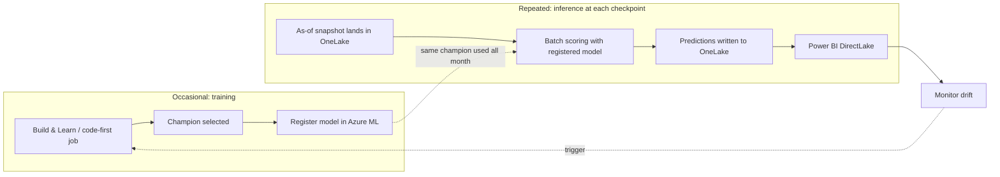

# Inference in production

> How the model you build and train in the **Build & Learn** UI is used to make
> predictions in production. All data here is synthetic; all identifiers are
> placeholders. Review with your finance, data, security, privacy, compliance,
> and operational stakeholders before any production use.

## The mental model: train once, score many times

The **Build & Learn** walkthrough teaches the same lifecycle you run in
production. The important split is:

- **Training** (Build & Learn steps 5–10) happens **occasionally** — on an
  approved retraining cadence or when drift/degradation/schema change triggers
  it. It produces a **champion** model.
- **Inference** (this document) happens **repeatedly during the month** — at
  each intra-month checkpoint (for example day 10, day 15, day 21) — **without
  retraining**. The month-end net-revenue target is only known after accounting
  close, so we score the champion against the partial-month snapshot as it fills
  in.



## What "inference" means for this use case

Given **partial-month snapshot rows** — one row per `facility_id ×
accounting_month × snapshot_date`, containing the flash-report operational
features known **as of** that checkpoint — produce:

- **Primary output:** `predicted_month_end_net_revenue` per facility.
- **Secondary outputs:** `model_name`, `model_version`, `run_id`, `cutoff_day`,
  `scored_at`, and — where the model supports it — `prediction_lower` /
  `prediction_upper` (uncertainty bounds).

Inference **does not** require the target column. It is validated with the same
data contract in inference mode (`require_target=False`).

## The trained artifact

Training (Build & Learn) yields a **champion bundle**
(`revenue_prediction.core.inference.ModelBundle`) that couples the fitted estimator
with its leakage-safe `feature_builder` and metadata (`model_version`,
`run_id`, `trained_at`). It is:

- saved locally with `save_bundle(...)` (used by the offline path and by the
  code-first Azure ML job), and/or
- logged as an **MLflow model** and **registered** in the Azure ML registry with
  lineage (see [`docs/governance/model-governance.md`](../governance/model-governance.md)).

The registered model — not a copy of the code — is what production scoring
loads.

## Inference contract (inputs)

Each checkpoint must present a snapshot that is **leakage-safe and as-of**:

- One row per facility for the accounting month, at the checkpoint
  `snapshot_date` / `snapshot_day`.
- Only information available **by that day** (flash-report operational features,
  plus historical features derived from strictly-prior closed months).
- `days_elapsed == snapshot_day`; `snapshot_date` within its `accounting_month`.
- **Never** the target or post-close fields (`final_contractual_adjustments`,
  `final_denials`, `month_end_close_flag`).

Validate before scoring:

```bash
revenue-prediction validate-data path/to/checkpoint_snapshot.parquet --no-require-target
```

## Inference outputs (self-describing)

`batch_predict(...)` returns a flat, typed table. Every prediction carries the
model version and run id, so any number in a Power BI report is traceable to the
exact model that produced it:

| Column | Meaning |
| --- | --- |
| `facility_id`, `accounting_month`, `snapshot_date`, `snapshot_day` | Grain / dimensions |
| `predicted_month_end_net_revenue` | Primary prediction |
| `prediction_lower`, `prediction_upper` | 95% bounds (ensemble models only; see note) |
| `model_name`, `model_version`, `run_id` | Model identity / lineage |
| `cutoff_day` | Checkpoint day scored |
| `scored_at` | UTC scoring timestamp |

## Two production modes

| Mode | When to use | Asset |
| --- | --- | --- |
| **Batch scoring (default)** | Scheduled scoring at each checkpoint; cheapest; no always-on cost. | [`mlops/endpoints/batch-endpoint.yml`](../../mlops/endpoints/batch-endpoint.yml), [`batch-deployment.yml`](../../mlops/endpoints/batch-deployment.yml) |
| **Managed online endpoint (optional)** | Low-latency, on-demand scoring (e.g. an app requests a single facility). Delete when idle. | [`online-endpoint.yml`](../../mlops/endpoints/online-endpoint.yml), [`online-deployment.yml`](../../mlops/endpoints/online-deployment.yml) |

Batch is the recommended default: predictions for all facilities are produced in
one scheduled run and landed for Power BI.

> [!IMPORTANT]
> **Endpoint recommendation for this use case: managed BATCH endpoint.**
> Azure ML offers three endpoint styles (see
> [Endpoints for inference](https://learn.microsoft.com/azure/machine-learning/concept-endpoints)):
> [**batch endpoints**](https://learn.microsoft.com/azure/machine-learning/concept-endpoints-batch)
> for high-throughput scheduled scoring over files, [**managed online
> endpoints**](https://learn.microsoft.com/azure/machine-learning/concept-endpoints-online)
> for low-latency request/response, and [**Kubernetes online
> endpoints**](https://learn.microsoft.com/azure/machine-learning/how-to-attach-kubernetes-anywhere)
> for self-managed AKS/Arc clusters. Net-revenue scoring runs **all
> facilities at each mid-month checkpoint on a schedule** with no low-latency
> requirement — the textbook fit for a **batch endpoint**, which Microsoft
> recommends "when you don't have low latency requirements" and your inputs are
> "distributed in multiple files"
> ([batch endpoints](https://learn.microsoft.com/azure/machine-learning/concept-endpoints-batch)).
> A batch deployment runs on a **compute cluster** and supports **scale-to-zero**,
> so there is no always-on cost. Choose a **managed online endpoint**
> only if you later need on-demand, single-facility, sub-second scoring (e.g. an
> interactive app); delete it when idle. A **Kubernetes online endpoint** is
> warranted only if you must run on an existing AKS cluster for org policy (via
> the Azure ML `KubernetesCompute` target; legacy `AksCompute` is retired).
> For portable, faster scoring, pair either with an [ONNX](onnx-optimization.md)
> model on a **prebuilt inference image**.


## Production runbook

### 1. Train & register (occasional)

Train and select the champion — the same pipeline the Build & Learn UI runs — as
a code-first Azure ML job, then register it:

```bash
# Submit the code-first training job (or run Build & Learn / make train locally)
uv sync --extra azure
az login
# build_command_job(...) -> ml_client.jobs.create_or_update(job)
# register_model_from_run(...) -> registers azureml:revenue-net-revenue-model
```

See [`docs/deployment/guide.md`](../deployment/guide.md) and
[`notebooks/code_first/`](../../notebooks/code_first/).

### 2. Land the checkpoint snapshot in OneLake

An upstream process writes the as-of snapshot (one row per facility for the
current month) to the Lakehouse input path
(`Files/revenue/input`). This is a generic "flash report" extract, aggregated to
facility level — no PHI.

### 3. Score with the registered model

Batch endpoint (cloud):

```bash
az ml batch-endpoint invoke --name revenue-batch-endpoint \
  --input azureml://datastores/<ds>/paths/revenue/input/checkpoint.parquet \
  -g <rg> -w <workspace>
```

Or the equivalent locally / in a Fabric notebook using the bundle:

```bash
revenue-prediction predict outputs/champion_bundle.joblib \
  checkpoint_snapshot.parquet --out predictions.parquet --cutoff-day 15
```

### 4. Write predictions to OneLake

```python
from revenue_prediction.integrations.fabric import write_predictions_to_onelake
write_predictions_to_onelake(predictions, settings.fabric)  # -> Files/revenue/predictions
```

### 5. Consume in Power BI

Build a **DirectLake** semantic model over the predictions table; the report
refreshes as new checkpoints land. See
[`docs/fabric/integration.md`](../fabric/integration.md).

### 6. Repeat at each checkpoint; monitor; retrain on trigger

Re-run steps 2–5 at each configured checkpoint **with the same champion**. Feed
input/prediction drift into monitoring; retrain only when justified (see
[`docs/operations/monitoring.md`](monitoring.md) and
[`retraining.md`](retraining.md)).

## Scheduling & cadence (Fabric Data Pipeline)

Orchestrate steps 2–5 as a **Fabric Data Pipeline** scheduled at each checkpoint
(e.g. after day 10, 15, 21). Scoring is stateless and does not retrain. A design
sketch is in
[`fabric/pipelines/revenue_scoring_pipeline.md`](../../fabric/pipelines/revenue_scoring_pipeline.md).

## How this maps to the Build & Learn UI

The UI teaches the lifecycle; production runs the same steps on a schedule with
the **registered** champion instead of an in-memory one.

| Build & Learn step | Production equivalent |
| --- | --- |
| 1 Frame · 2 Explore · 3 Target | Fixed once: the agreed prediction, grain, and net-revenue definition |
| 4 Leakage · 5 Split · 6 Features | The **inference contract**: as-of, leakage-safe snapshot; the champion's feature builder is applied at score time |
| 7 Baselines · 8 Train · 9 Evaluate · 10 Select | The **occasional training job** that produces & registers the champion |
| 11 Explain | Feature-importance shown to finance to build trust in each run |
| 12 Deliver | This runbook: register → batch score → OneLake → Power BI → monitor → retrain |

## Uncertainty / prediction intervals (note)

`batch_predict` emits `prediction_lower`/`prediction_upper` for ensemble models
that expose per-estimator variance (random forest, bagging, XGBoost via its
sklearn API). Histogram Gradient Boosting does not expose this, so intervals are
omitted for it. If calibrated intervals are a hard requirement for every
champion, add quantile regression or conformal prediction as a follow-up (a
documented extension point).

## Local dry-run (fully offline)

You can rehearse the entire production inference path without any cloud:

```bash
uv run revenue-prediction generate-data
uv run revenue-prediction train-local --out outputs           # -> champion bundle
uv run revenue-prediction predict outputs/champion_bundle.joblib \
    data/synthetic/revenue_snapshots.parquet --out outputs/predictions.csv --cutoff-day 15
```

The OneLake client falls back to the local filesystem, so
`write_predictions_to_onelake(..., local_root=...)` produces the same
Power BI-ready table locally.

## Code & assets

- Inference: `revenue_prediction.core.inference` (`ModelBundle`, `batch_predict`,
  `save_bundle`, `load_bundle`).
- OneLake I/O: `revenue_prediction.integrations.fabric` (`write_predictions_to_onelake`).
- Azure ML jobs/registration: `revenue_prediction.integrations.azureml`.
- Endpoints & monitoring: [`mlops/endpoints/`](../../mlops/endpoints/),
  [`mlops/monitoring/`](../../mlops/monitoring/).
- Inference I/O schema: [`mlops/schemas/inference_io.json`](../../mlops/schemas/inference_io.json).
