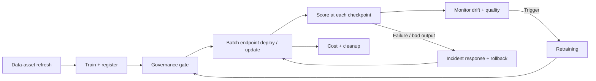

# Operational runbooks

Task-focused, copy-pasteable procedures for running the accelerator on Azure ML.
Every command uses **placeholder identifiers** (`WORKSPACE_PLACEHOLDER`,
`<rg>`, `<workspace>`) and **synthetic data**. Review every action with your
finance, data, security, privacy, compliance, and operational stakeholders
before any production use.

> Conventions used in all runbooks:
> - Grain: `facility_id × accounting_month × snapshot_date` (`snapshot_day`).
> - Primary metric: **WAPE** (dollar-weighted); **bias** reported alongside.
> - Batch endpoint: `revenue-batch-endpoint`; default deployment:
>   `champion-pipeline` (a **pipeline-component** deployment).
> - Registered model: `revenue-net-revenue-model`.

## Index

| Runbook | Use it when… |
| --- | --- |
| [Batch endpoint deploy & update](batch-endpoint-deploy-and-update.md) | You need to create, update, or set the default batch deployment (e.g. promote a new model version). |
| [Promote across environments (dev → test → prod)](promote-across-environments.md) | You are moving a governed model through dev → test → prod with gated approval. |
| [Incident response & rollback](incident-response-and-rollback.md) | A prediction run fails, a bad model was promoted, or output looks wrong and you must roll back safely. |
| [Data-asset refresh](data-asset-refresh.md) | New closed months arrive or an upstream schema changes and you must re-register the input dataset. |
| [Inference in production](../inference-in-production.md) | End-to-end scoring at each checkpoint (train once, score many). |
| [Monitoring](../monitoring.md) | Set up / read drift, quality, and continuous-evaluation signals. |
| [Retraining](../retraining.md) | Decide whether to retrain and run the governed retraining loop. |
| [Cost & cleanup](../cost-and-cleanup.md) | Tear down demo infrastructure and avoid ongoing cost. |
| [ONNX optimization](../onnx-optimization.md) | Export a portable, faster scoring model. |

## End-to-end operational lifecycle



## Prerequisites (all runbooks)

```bash
uv sync --extra azure
az login
uv run revenue-prediction info --env dev   # verify configuration (no secrets printed)
```

Set your workspace via environment variables (never commit them):

```bash
export RPA_AZURE_ML__SUBSCRIPTION_ID=<your-subscription-id>
export RPA_AZURE_ML__RESOURCE_GROUP=<rg>
export RPA_AZURE_ML__WORKSPACE_NAME=<workspace>
```
