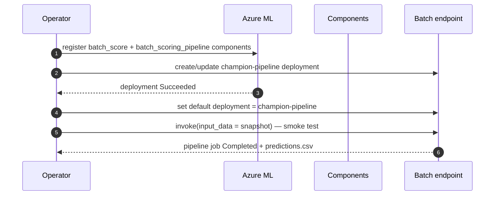

# Runbook — Batch endpoint deploy & update

Create, update, and set the default deployment for the batch endpoint
`revenue-batch-endpoint`. The deployment is a **pipeline-component** deployment
(`champion-pipeline`) that scores the registered MLflow champion by running a
command component in the prebuilt `revenue-prediction-env` image — so invocation
**never triggers an image build** (`prepare_image`).

> Background on *why* the pipeline-component approach is used (the
> `azureml-dataset-runtime` / `pyarrow` conflict in no-code model batch
> deployments) is in
> [inference-in-production.md → How the batch deployment works](../inference-in-production.md#how-the-batch-deployment-works-pipeline-component).

## Assets

| File | Role |
| --- | --- |
| [`mlops/endpoints/batch-endpoint.yml`](../../../mlops/endpoints/batch-endpoint.yml) | The endpoint (`revenue-batch-endpoint`). |
| [`mlops/endpoints/batch-deployment.yml`](../../../mlops/endpoints/batch-deployment.yml) | The `champion-pipeline` deployment (`type: pipeline`). |
| [`mlops/components/batch_scoring_pipeline.yml`](../../../mlops/components/batch_scoring_pipeline.yml) | Single-step pipeline; binds the model as `mlflow_model`. |
| [`mlops/components/batch_score.yml`](../../../mlops/components/batch_score.yml) | Command component running `azureml_batch_score`. |

## Deploy sequence



## 1. Register (or bump) the components

Component `inputs` are **immutable per version** — if you change a component's
interface, bump its `version` in the YAML before re-registering.

```bash
az ml component create -f mlops/components/batch_score.yml -g <rg> -w <workspace>
az ml component create -f mlops/components/batch_scoring_pipeline.yml -g <rg> -w <workspace>
```

The pipeline component binds the model explicitly as an `mlflow_model` input:

```yaml
# mlops/components/batch_scoring_pipeline.yml (excerpt)
inputs:
  model:
    type: mlflow_model
    path: azureml:revenue-net-revenue-model@latest
```

> If you point the deployment at a **specific** model version, change
> `@latest` to `:<version>` and re-register the pipeline component.

## 2. Create or update the deployment

```bash
# Ensure the endpoint exists (idempotent)
az ml batch-endpoint create -f mlops/endpoints/batch-endpoint.yml -g <rg> -w <workspace> || true

# Create/update the pipeline-component deployment
az ml batch-deployment create -f mlops/endpoints/batch-deployment.yml \
  -g <rg> -w <workspace> --set-default
```

> **Deployment type is immutable.** You cannot convert an existing model-batch
> deployment into a pipeline deployment in place — use a **new deployment name**
> and set it as default (the working deployment here is `champion-pipeline`).

SDK v2 equivalent:

```python
from azure.ai.ml import load_component, load_batch_deployment
from revenue_prediction.config.loader import load_settings
from revenue_prediction.integrations.azureml.client import get_ml_client

client = get_ml_client(load_settings("dev").azure_ml)
client.components.create_or_update(load_component("mlops/components/batch_score.yml"))
client.components.create_or_update(load_component("mlops/components/batch_scoring_pipeline.yml"))

deployment = load_batch_deployment("mlops/endpoints/batch-deployment.yml")
client.batch_deployments.begin_create_or_update(deployment).result()

endpoint = client.batch_endpoints.get("revenue-batch-endpoint")
endpoint.defaults.deployment_name = deployment.name
client.batch_endpoints.begin_create_or_update(endpoint).result()
```

## 3. Smoke-test the deployment

```bash
az ml batch-endpoint invoke --name revenue-batch-endpoint \
  --input azureml:revenue_snapshots@latest \
  -g <rg> -w <workspace>
```

Verify the pipeline job **Completed** and the output contains `predictions.csv`
with the expected row count and the self-describing columns
(`predicted_month_end_net_revenue`, `model_version`, `run_id`, `cutoff_day`,
`scored_at`). Confirm **no `prepare_image` job** was created.

## 4. Promote a new model version (blue/green)

1. Register the new champion (see [retraining](../retraining.md)).
2. Re-register `batch_scoring_pipeline` so it resolves the new model
   (`@latest` or a pinned `:<version>`).
3. Create a **new** deployment name (e.g. `champion-pipeline-v2`) from an edited
   copy of `batch-deployment.yml`.
4. Smoke-test the new deployment by invoking it **by name**:
   `az ml batch-endpoint invoke --name revenue-batch-endpoint --deployment-name champion-pipeline-v2 ...`.
5. When satisfied, set it as default; keep the previous deployment until the new
   one has run cleanly for one cycle, then remove the old one.

## Rollback

Set the endpoint default back to the previous known-good deployment:

```bash
az ml batch-endpoint update --name revenue-batch-endpoint \
  --set defaults.deployment_name=<previous-deployment> -g <rg> -w <workspace>
```

See [incident-response-and-rollback.md](incident-response-and-rollback.md) for
the full incident procedure.

## Related

- [Inference in production](../inference-in-production.md)
- [Incident response & rollback](incident-response-and-rollback.md)
- [Cost & cleanup](../cost-and-cleanup.md)
