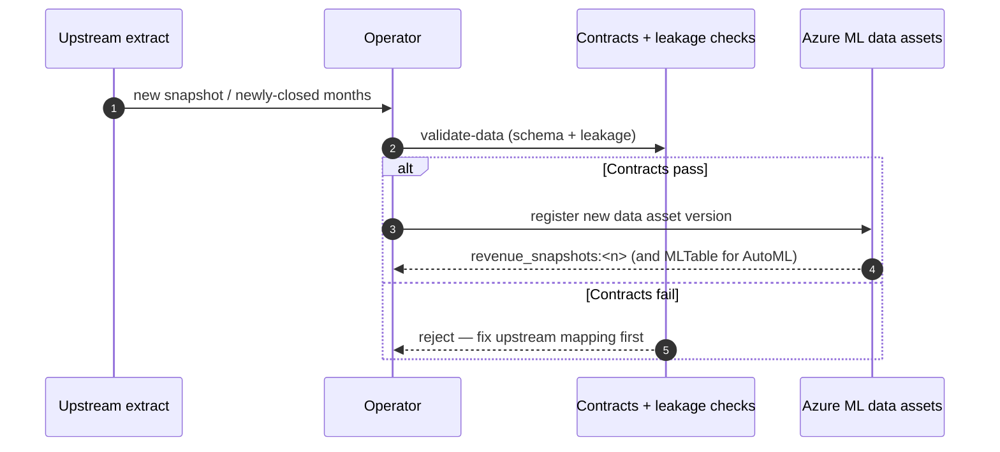

# Runbook — Data-asset refresh

Re-register the input dataset when new **closed months** arrive or an upstream
**schema change** occurs, keeping lineage intact and leakage rules enforced.

> Synthetic data only. The same steps apply to a real extract once it has passed
> your organization's privacy, security, and de-identification review.

## When to run this

- New accounting months have **closed** and should join the training set.
- The upstream "flash report" extract adds/removes columns or changes semantics.
- You are staging a fresh **checkpoint snapshot** for scoring.

## Refresh sequence



## 1. Validate before registering

Always run the contracts and leakage checks first — a bad schema must never
reach the registry.

```bash
# Training data must include the target; a scoring snapshot must not
uv run revenue-prediction validate-data <new_dataset>.parquet                     # training
uv run revenue-prediction validate-data <checkpoint_snapshot>.parquet --no-require-target
```

If validation fails, fix the upstream mapping (column names, dtypes, snapshot-day
values) before continuing. Schema and leakage rules live in
[`src/revenue_prediction/core/data/`](../../../src/revenue_prediction/core/data/)
and [`data/contracts/`](../../../data/contracts/).

## 2. Register a new data-asset version

Registering a **new version** (never overwriting) preserves lineage — every
training run records exactly which data version it used.

```bash
# Code-first (Parquet URI-file)
az ml data create --name revenue_snapshots --version <n> \
  --type uri_file --path <new_dataset>.parquet -g <rg> -w <workspace>

# AutoML (MLTable)
az ml data create --name revenue_snapshots_mltable --version <n> \
  --type mltable --path <mltable_dir>/ -g <rg> -w <workspace>
```

SDK v2 equivalent:

```python
from azure.ai.ml.entities import Data
from azure.ai.ml.constants import AssetTypes
from revenue_prediction.config.loader import load_settings
from revenue_prediction.integrations.azureml.client import get_ml_client

client = get_ml_client(load_settings("dev").azure_ml)
client.data.create_or_update(Data(
    name="revenue_snapshots", version="<n>",
    type=AssetTypes.URI_FILE, path="<new_dataset>.parquet",
))
```

## 3. Handle a schema change

1. Update the contract/schema in
   [`src/revenue_prediction/core/data/schema.py`](../../../src/revenue_prediction/core/data/schema.py)
   and any leakage rules, with tests.
2. Run `make check` (ruff, pyright, pytest) offline.
3. Register the new data version, then **retrain** so the model matches the new
   schema — see [retraining.md](../retraining.md). A schema change is an
   explicit retraining trigger.

## 4. Point training/scoring at the new version

- Training and the scoring pipeline reference `azureml:revenue_snapshots@latest`
  by default; pin `:<n>` when you need an exact, reproducible version.
- After registering, run a scoring smoke test
  (see [batch-endpoint-deploy-and-update.md](batch-endpoint-deploy-and-update.md#3-smoke-test-the-deployment)).

## Related

- [Retraining](../retraining.md) · [Monitoring](../monitoring.md)
- [Inference in production](../inference-in-production.md)
