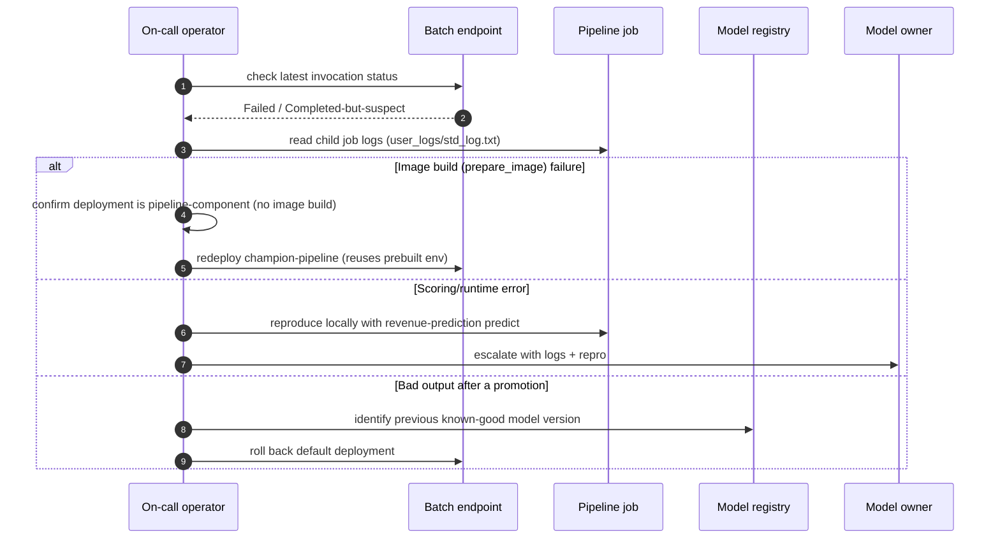

# Runbook — Incident response & rollback

Detect, triage, and recover from batch-scoring incidents: a failed run, a bad
model promotion, or output that looks wrong. Keep changes **reversible** and
prefer rolling back to a known-good state over hot-fixing in place.

> All identifiers are placeholders. Never paste real subscription/tenant/
> workspace IDs, secrets, or customer data into tickets or logs.

## Triage sequence



## 1. Detect

Signals that open an incident:

- A batch invocation is **Failed** or stuck.
- Monitoring flags a **drift** or **quality** breach (see [monitoring](../monitoring.md)).
- Output is present but **implausible** (nulls, out-of-range revenue, wrong row
  count, missing self-describing columns).

Check the most recent invocation:

```bash
az ml job list --query "[?contains(name,'pipelinejob')].{name:name,status:status}" \
  -g <rg> -w <workspace> -o table
```

## 2. Triage — read the logs first

```bash
# Parent pipeline job
az ml job show --name <pipelinejob-...> -g <rg> -w <workspace> -o table

# Download the scoring child job's logs
az ml job download --name <child-job> --download-path /tmp/rpa-incident -g <rg> -w <workspace>
# Inspect: /tmp/rpa-incident/**/user_logs/std_log.txt
```

Classify the failure:

| Symptom in logs | Likely cause | Go to |
| --- | --- | --- |
| `prepare_image` / `docker build` / `ResolutionImpossible` | A **no-code model batch** deployment is in use (wrong deployment type). | §3a |
| Python traceback in `azureml_batch_score` | Scoring/runtime bug or bad input schema. | §3b |
| Job Completed but output wrong | Bad model version or bad input data. | §3c |

## 3. Contain & recover

### 3a. Image-build (`prepare_image`) failure

The supported deployment is **pipeline-component** (`champion-pipeline`), which
reuses the prebuilt environment image and does **not** build an image at invoke
time. If you see `prepare_image` failures, a no-code **model batch** deployment
was (re)introduced.

1. Confirm deployments on the endpoint:
   ```bash
   az ml batch-deployment list --endpoint-name revenue-batch-endpoint -g <rg> -w <workspace> -o table
   ```
2. Ensure the default is `champion-pipeline`; re-create it if missing
   (see [batch-endpoint-deploy-and-update.md](batch-endpoint-deploy-and-update.md)).
3. Delete the offending model-batch deployment once it is no longer the default.

### 3b. Scoring/runtime error

Reproduce locally against synthetic data to isolate code vs. environment:

```bash
uv run revenue-prediction validate-data <snapshot>.parquet --no-require-target
uv run revenue-prediction predict outputs/champion_bundle.joblib <snapshot>.parquet \
  --out /tmp/predictions.csv --cutoff-day 15
```

- If it fails locally too → code/data bug; fix and add a test, then retrain/
  re-register.
- If it only fails in the cloud → environment/permissions; verify the
  `revenue-prediction-env` image and datastore/model RBAC.

### 3c. Bad output after a promotion — roll back

Roll the endpoint default back to the previous known-good deployment (fast,
reversible):

```bash
az ml batch-endpoint update --name revenue-batch-endpoint \
  --set defaults.deployment_name=<previous-deployment> -g <rg> -w <workspace>
```

If the deployment itself is fine but the **model version** is bad, re-register
the pipeline component pinned to the last-good version and redeploy:

```yaml
# mlops/components/batch_scoring_pipeline.yml (excerpt)
inputs:
  model:
    type: mlflow_model
    path: azureml:revenue-net-revenue-model:<previous-good-version>
```

Then follow [batch-endpoint-deploy-and-update.md](batch-endpoint-deploy-and-update.md).

## 4. Verify recovery

```bash
az ml batch-endpoint invoke --name revenue-batch-endpoint \
  --input azureml:revenue_snapshots@latest -g <rg> -w <workspace>
```

Confirm: pipeline job **Completed**, `predictions.csv` has the expected rows and
self-describing columns, and **no new `prepare_image` job** was created.

## 5. Post-incident

- Record root cause, the exact model/deployment versions involved, and the fix.
- Add or update a test that would have caught the failure offline (`make check`).
- If governance-relevant, note the incident in
  [model-governance.md](../../governance/model-governance.md) history.

## Related

- [Batch endpoint deploy & update](batch-endpoint-deploy-and-update.md)
- [Monitoring](../monitoring.md) · [Retraining](../retraining.md)
- [Inference in production](../inference-in-production.md)
