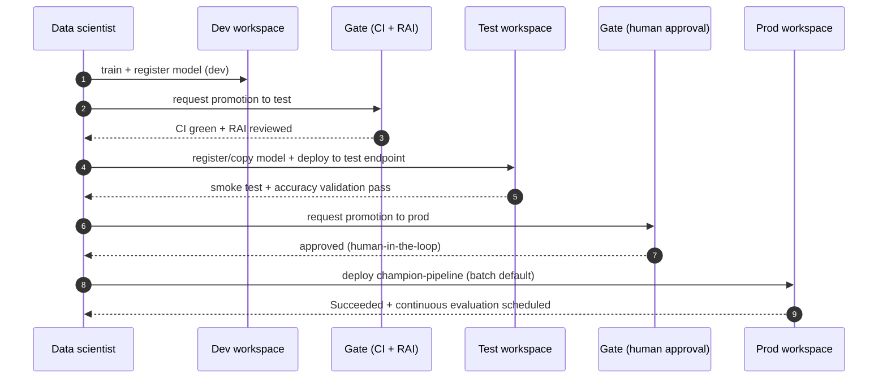

# Runbook — Promote across environments (dev → test → prod)

Move one governed model through **dev → test/staging → prod** with human-gated
approval, mirroring the MLOps v2 classical-ML outer loop
([reference](https://learn.microsoft.com/azure/architecture/ai-ml/guide/machine-learning-operations-v2#classical-machine-learning-architecture)).
The **same code** runs in every environment; only the `configs/<env>` profile and
the target workspace change.

> Cloud identifiers come **only** from environment variables — never commit them.
> All data is synthetic.

## Environments

| Env | Config | Purpose | Typical workspace |
| --- | --- | --- | --- |
| `dev` | [`configs/dev/config.yaml`](../../../configs/dev/config.yaml) | Fast iteration, small dataset, small AutoML budget. | Development workspace |
| `test` | [`configs/test/config.yaml`](../../../configs/test/config.yaml) | Deterministic validation, endpoint smoke, contracts, RAI checks. | Test/staging workspace |
| `prod` | [`configs/prod/config.yaml`](../../../configs/prod/config.yaml) | Full history and model set; governed production scoring. | Production workspace |

Set the environment and its workspace per stage:

```bash
export RPA_ENV=dev            # dev | test | prod
export RPA_AZURE_ML__SUBSCRIPTION_ID=<sub>
export RPA_AZURE_ML__RESOURCE_GROUP=<rg-for-this-env>
export RPA_AZURE_ML__WORKSPACE_NAME=<workspace-for-this-env>
uv run revenue-prediction info --env $RPA_ENV     # verify (no secrets printed)
```

## Promotion sequence



## 1. Dev — train, register, evaluate

```bash
# Submit training (code-first or AutoML) against the dev workspace, then register
# See deployment/guide.md and runbooks/batch-endpoint-deploy-and-update.md
uv run revenue-prediction info --env dev
```

Gate to leave dev: **CI green** (`make check`), disaggregated accuracy reviewed
(by facility and snapshot day), and the Responsible AI checklist complete
([governance/responsible-ai.md](../../governance/responsible-ai.md)).

## 2. Test / staging — validate on a separate workspace

1. Make the approved model available in the test workspace (register there, or
   share via an Azure ML **registry**).
2. Deploy to a **test** batch endpoint and smoke-test it
   (see [batch-endpoint-deploy-and-update.md](batch-endpoint-deploy-and-update.md#3-smoke-test-the-deployment)).
3. Run **continuous evaluation** against a held-out closed period and confirm
   WAPE/bias meet the bar
   (see [monitoring.md → Continuous evaluation](../monitoring.md#continuous-evaluation-predictions-vs-actuals)).
4. Confirm data contracts and endpoint behavior on the test dataset.

Gate to leave test: **human approval** after validation evidence is attached.

## 3. Prod — deploy under governance

1. Deploy the `champion-pipeline` batch deployment to the **prod** endpoint and
   set it as default
   ([batch-endpoint-deploy-and-update.md](batch-endpoint-deploy-and-update.md)).
2. Schedule **monitoring** (drift + data quality) and **continuous evaluation**
   (predictions vs actuals).
3. Keep the previous production deployment until the new one has run cleanly for
   one cycle, then retire it.

## Rollback

Promotion is reversible at every stage — set the endpoint default back to the
prior deployment and, if needed, pin the pipeline component to the last-good
model version. Follow
[incident-response-and-rollback.md](incident-response-and-rollback.md).

## RBAC note

MLOps v2 recommends distinct roles per environment (data scientists get
higher access in preproduction; production is tighter, CI/CD-driven). See the
persona-based RBAC tables in the
[reference architecture](https://learn.microsoft.com/azure/architecture/ai-ml/guide/machine-learning-operations-v2#identity-azure-rbac)
and [security/networking.md](../../security/networking.md).

## Related

- [MLOps v2 mapping](../../architecture/mlops-v2.md)
- [Batch endpoint deploy & update](batch-endpoint-deploy-and-update.md)
- [Retraining](../retraining.md) · [Monitoring](../monitoring.md)
