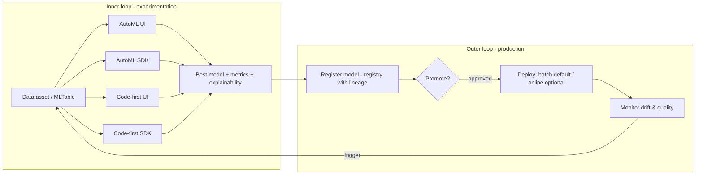

# End-to-end patterns

This accelerator demonstrates **four end-to-end ways** to train and operate the
net-revenue model on Azure Machine Learning, all following the classical-ML
**MLOps v2** reference architecture and deployable into a **secure, managed-VNet
workspace**.

| # | Pattern | Authoring surface | Guide |
| --- | --- | --- | --- |
| 1 | **Automated ML via UI** | Azure ML Studio (Automated ML wizard) | [automl-ui.md](automl-ui.md) |
| 2 | **Automated ML via SDK** | Python SDK v2 (`azure-ai-ml`) | [automl-sdk.md](automl-sdk.md) |
| 3 | **Azure ML code-first via SDK** | Python SDK v2 (command & pipeline jobs) | [aml-sdk.md](aml-sdk.md) |
| 4 | **Azure ML code-first via UI** | Azure ML Studio (Job creation UI / Designer) | [aml-ui.md](aml-ui.md) |

All four produce a **registered model** that is governed, deployed, and monitored
identically — the difference is only *how the model is authored*.

## Why four patterns

- **AutoML** (patterns 1–2) quickly finds a strong baseline and is ideal for
  analysts and for benchmarking. It handles featurization, model search, and
  explainability automatically.
- **Code-first** (patterns 3–4) gives full control of features, validation, and
  model choice, and is easiest to govern and reproduce.
- **UI vs SDK**: the UI is approachable and great for learning/demos; the SDK is
  reproducible, reviewable, and CI/CD-friendly. Offering both means the same
  team can start in the UI and graduate to code.

The [Build & Learn UI](../../frontend/) teaches the *process* behind all four;
these docs show how to run each on Azure.

## MLOps v2 mapping (classical ML)

All patterns slot into the same lifecycle (see
[../architecture/mlops-v2.md](../architecture/mlops-v2.md)):

- **Inner loop** (dev): data prep, the four authoring patterns, evaluation,
  explainability — CI validates code and data contracts.
- **Outer loop** (test → prod): registration, gated promotion, deployment,
  monitoring, retraining — CD promotes across environments.
- **Environments**: `dev` / `test` / `prod` config profiles under
  [`configs/`](../../configs/).

## Secure workspace context

For production, run every pattern against a **secure, managed-VNet workspace**
(public access disabled, private endpoints, Bastion + jump box), provisioned by
[`infra/terraform/`](../../infra/terraform/) or
[`infra/bicep/`](../../infra/bicep/) (secure profile). This mirrors Microsoft's
*Create a secure workspace with a managed virtual network* tutorial. See
[../security/networking.md](../security/networking.md).

- AutoML/code-first jobs run on compute **inside** the managed VNet.
- Data (MLTable) is read from firewalled Storage via private endpoints.
- The Studio UI is reached through the jump box (`az login --identity`).

## Which pattern should we use?

For this use case (facility net revenue, mid-month checkpoints):

- **Start** with **AutoML (SDK)** to establish a strong, explainable baseline and
  benchmark WAPE.
- **Graduate** to **code-first (SDK)** as the champion path — it gives explicit
  leakage-safe features, time-aware validation, and full reproducibility for
  governance.
- Use the **UI patterns** for enablement, demos, and analyst self-service.

See each pattern's guide for step-by-step instructions.

## Deployment & inference (same for all four)

Every pattern produces a **registered model** that is deployed and monitored
identically. Azure ML offers three
[endpoint styles](https://learn.microsoft.com/azure/machine-learning/concept-endpoints):
[**batch**](https://learn.microsoft.com/azure/machine-learning/concept-endpoints-batch),
[**managed online**](https://learn.microsoft.com/azure/machine-learning/concept-endpoints-online),
and [**Kubernetes online** (AKS/Arc)](https://learn.microsoft.com/azure/machine-learning/how-to-attach-kubernetes-anywhere).

For this use case (all facilities scored on a mid-month schedule, no low-latency
need), the recommended default is a **batch endpoint** — Microsoft advises batch
"when you don't have low latency requirements" and inputs are "distributed in
multiple files"
([batch endpoints](https://learn.microsoft.com/azure/machine-learning/concept-endpoints-batch)).
A batch deployment runs on a **compute cluster** with **scale-to-zero**, so there
is no always-on cost. Use a **managed online endpoint** only for on-demand,
sub-second, single-facility scoring, and a **Kubernetes online endpoint** only
when org policy requires an existing AKS/Arc cluster (via the `KubernetesCompute`
target; legacy `AksCompute` is retired). Full runbook:
[../operations/inference-in-production.md](../operations/inference-in-production.md).
