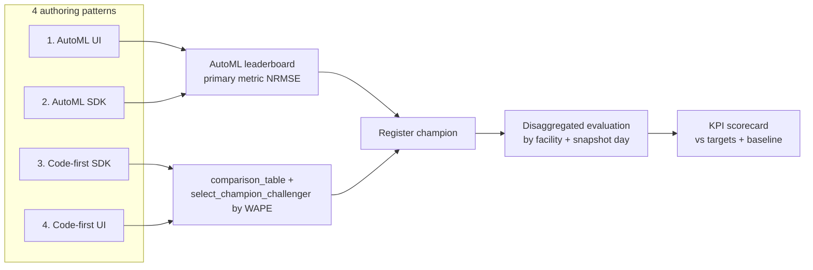

# Model selection, comparison & evaluation — step by step across all four patterns

The accelerator authors **one governed model** four ways. Whichever pattern you
use, the **evaluation metrics** (WAPE dollar-weighted, bias, disaggregated by
facility and snapshot day) and the **selection logic** (champion/challenger) are
consistent. This page walks each pattern's *compare → select → evaluate* steps.

> Grain: `facility_id × accounting_month × snapshot_date`. Headline metric:
> **WAPE**; **bias** reported alongside. See
> [modeling/success-metrics-and-kpis.md](../modeling/success-metrics-and-kpis.md).

## Where selection and metrics live



- **AutoML (patterns 1–2):** Azure ML ranks candidates on a **leaderboard** by the
  configured primary metric (`normalized_root_mean_squared_error`) and marks the
  **best model**; explanations are generated automatically.
- **Code-first (patterns 3–4):** the repo's
  [`select_champion_challenger`](../../src/revenue_prediction/core/evaluation/selection.py)
  ranks candidates by **WAPE** and flags a challenger; metrics are logged to
  MLflow.

Both converge on a **registered model** and the same disaggregated evaluation and
KPI scorecard.

## Pattern 1 — AutoML via the Studio UI (no-code)

1. **Submit:** Studio → Automated ML → Regression → target
   `actual_month_end_net_revenue`, k-fold CV, featurization Auto, explainability on.
2. **Compare models:** open the job's **Models / leaderboard** tab. Candidates are
   ranked by the primary metric; each row shows validation metrics.
3. **Select the model:** AutoML marks the **best model**. Open it → **Metrics** and
   **Explanations** to confirm drivers make sense (volume, gross charges, prior
   net revenue).
4. **Evaluate deeper:** register the best model, then run disaggregated evaluation
   (by facility / snapshot day) and the KPI scorecard (below).

See [patterns/automl-ui.md](automl-ui.md).

## Pattern 2 — AutoML via the SDK

1. **Submit** with [`build_regression_job`](../../src/revenue_prediction/integrations/automl/regression.py)
   (`enable_model_explainability=True`).
2. **Compare / select** programmatically:

   ```python
   ml_client.jobs.stream(job.name)
   best = ml_client.jobs.get(job.name)  # AutoML tags the best child run
   # Or enumerate children and rank by the primary metric in MLflow.
   ```

3. **Evaluate:** the leaderboard and best-run metrics appear in Studio and MLflow;
   register the best model for the shared evaluation path.

See [patterns/automl-sdk.md](automl-sdk.md).

## Pattern 3 — Code-first via the SDK (the champion path)

1. **Train candidates** (baselines + regressors) with time-aware validation on
   Azure ML compute (`core.training.azureml_entry`).
2. **Compare models** with the tidy table:

   ```python
   from revenue_prediction.core.evaluation import comparison_table, select_champion_challenger
   table = comparison_table(results)                      # one row per candidate, all metrics
   selection = select_champion_challenger(results, metric="wape")
   print(selection.champion, selection.challenger, selection.challenger_promotable)
   ```

3. **Select the champion:** lowest **WAPE** on the held-out test block; the runner
   up is the challenger. Promotion needs the challenger to beat the incumbent by
   `challenger_improvement_threshold` (default 2%).
4. **Evaluate:** metrics are logged to MLflow (Azure ML tracking); disaggregate by
   facility / snapshot day and run the KPI scorecard.

See [patterns/aml-sdk.md](aml-sdk.md).

## Pattern 4 — Code-first via the Studio UI / Designer

1. **Submit** the same entry point as a **Command job** (Studio → Jobs → Create) or
   via the registered component
   [`mlops/components/train_code_first.yml`](../../mlops/components/train_code_first.yml)
   in the **Designer**.
2. **Compare / select:** identical code path — `select_champion_challenger` by
   WAPE runs inside the job; the champion and comparison table are in the run's
   **Outputs + logs** and MLflow metrics.
3. **Evaluate:** open the run's **Metrics**; register the champion.

See [patterns/aml-ui.md](aml-ui.md).

## Cross-cutting — the same evaluation for every pattern

Whatever authored the model, evaluate it the same way:

```python
from revenue_prediction.core.evaluation import (
    compute_metrics, metrics_by_facility, metrics_by_snapshot_day, kpi_scorecard,
)

overall = compute_metrics(y_true, y_pred)               # WAPE, bias, MAE, RMSE, ...
by_fac = metrics_by_facility(frame, TARGET, PRED)       # a good average can hide a bad facility
by_day = metrics_by_snapshot_day(frame, TARGET, PRED)   # day-10 accuracy differs from day-24
board  = kpi_scorecard(overall, by_day, baseline_wape=0.08)  # vs targets + manual baseline
```

Or from the CLI once actuals are known:

```bash
uv run revenue-prediction scorecard predictions.parquet actuals.parquet --baseline-wape 0.08
```

- **Disaggregation** (by facility, by snapshot day) is mandatory — a strong system
  average can mask a weak facility or a weak early checkpoint.
- **Governance:** champion/challenger promotion is human-gated; see
  [governance/model-governance.md](../governance/model-governance.md).
- **Business alignment:** grade against targets and KPIs in
  [modeling/success-metrics-and-kpis.md](../modeling/success-metrics-and-kpis.md).

## Related

- [End-to-end patterns hub](end-to-end-patterns.md)
- [Success metrics & KPIs](../modeling/success-metrics-and-kpis.md)
- [Model governance](../governance/model-governance.md)
