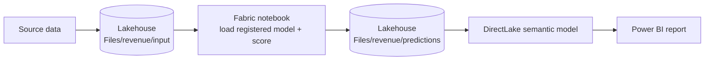

# Fabric assets

Assets that run **inside Microsoft Fabric** (as opposed to
[`notebooks/fabric/`](../notebooks/fabric/), which run locally against OneLake).

| Path | Description |
| --- | --- |
| `notebooks/` | Fabric notebook(s) that read Lakehouse inputs and write predictions |
| `pipelines/` | Fabric Data Pipeline design (conceptual) |

## Concept

## How the model gets into Fabric

Two common options:

1. **Score in Fabric** with the accelerator installed as a library, loading the
   MLflow model registered in Azure ML (or exported to the Lakehouse).
2. **Score in Azure ML** (batch endpoint) and land predictions in the Lakehouse
   via OneLake.

Either way, predictions are written as a flat, typed table for a **DirectLake**
semantic model. See [`docs/fabric/integration.md`](../docs/fabric/integration.md).

## Identifiers

All workspace/lakehouse identifiers are placeholders
(`WORKSPACE_PLACEHOLDER`, `LAKEHOUSE_PLACEHOLDER`). Supply real values in Fabric;
never commit them.
