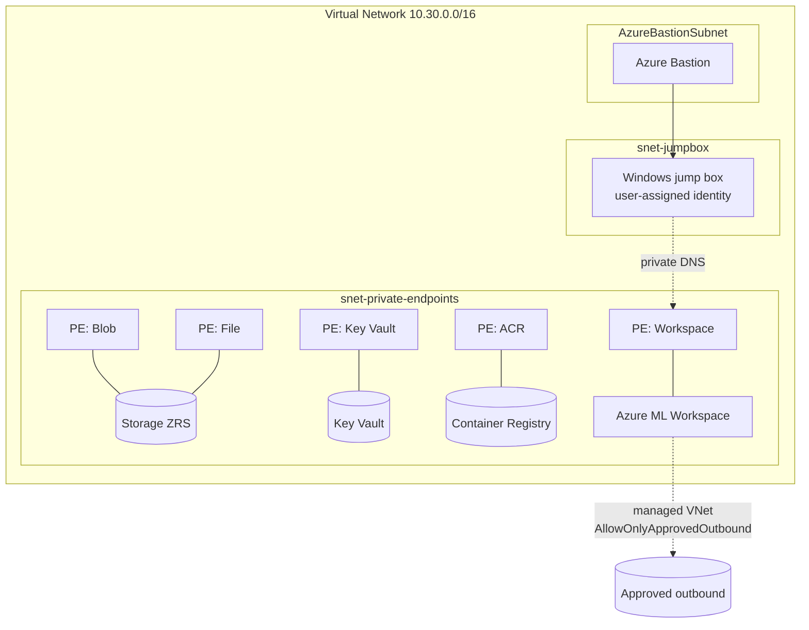

# Terraform — Secure (Managed VNet)

Production-grade Azure Machine Learning workspace with **managed VNet
isolation**, **firewalled** Storage/Key Vault/ACR, **private endpoints** +
**private DNS**, **Azure Bastion**, and an **Entra-joinable Windows jump box**.
Synthetic data only; review the official guidance before production use.

## Architecture



## Resources

- VNet with three subnets (private endpoints, jump box, `AzureBastionSubnet`)
- Private DNS zones + VNet links (blob, file, vault, acr, api, notebooks)
- Storage (ZRS, public access disabled), Key Vault, ACR (Premium) — all
  firewalled with private endpoints
- Application Insights
- Azure ML workspace: `public_network_access_enabled = false`, managed VNet
  `AllowOnlyApprovedOutbound`, system-assigned identity, workspace private
  endpoint
- Azure Bastion + Windows jump box (user-assigned identity with
  `AzureML Data Scientist`)
- Workspace identity: storage blob/file data access and Reader on the client
  Blob/File private endpoints
- Designated human user: `AzureML Data Scientist` on the workspace and
  `Storage Blob Data Contributor` on its default storage

## Verified prerequisites

Run these commands from the repository root. Use the subscription that will own
the deployment; don't put subscription or tenant IDs in repository files.

```bash
az login --tenant <RESOURCE_TENANT_ID>
az account set --subscription <SUBSCRIPTION_ID_OR_NAME>
az account show --query '{name:name,state:state,tenantId:tenantId,user:user.name}'

az extension add --name ml --upgrade --yes
for provider in Microsoft.MachineLearningServices Microsoft.ContainerRegistry \
  Microsoft.Storage Microsoft.KeyVault Microsoft.Network Microsoft.Compute \
  Microsoft.Insights; do
  az provider show --namespace "$provider" --query registrationState -o tsv
done
```

Every provider must report `Registered`. The deploying identity needs
`Contributor` plus `User Access Administrator`, or `Owner`, at the deployment
scope because Terraform creates resources and role assignments. It also needs
permission to approve managed-network private endpoint connections. `Owner`
covers that requirement for resources created in this resource group.

### External account access

`workspace_user_object_id` must be the object ID for your user **in the resource
tenant**. If the subscription is in another tenant, first invite the external
account as a Microsoft Entra B2B guest and accept the invitation. Then sign in
to the resource tenant and resolve the object used by the current session:

```bash
az login --tenant <RESOURCE_TENANT_ID>
WORKSPACE_USER_OBJECT_ID="$(az ad signed-in-user show --query id -o tsv)"
test -n "$WORKSPACE_USER_OBJECT_ID"
```

Don't use the account's object ID from its home tenant. Terraform assigns the
resource-tenant object the Azure ML and storage data-plane roles required by
this use case.

## Provision

```bash
cd infra/terraform
cp terraform.tfvars.example terraform.tfvars
# Edit nonsecret naming, region, network, and tag values. Keep
# workspace_user_object_id out of this file; supply it through the environment.

export TF_VAR_workspace_user_object_id="$WORKSPACE_USER_OBJECT_ID"
terraform fmt -check
terraform init -backend=false
terraform validate
terraform plan -out secure.tfplan
terraform apply secure.tfplan

RG="$(terraform output -raw resource_group_name)"
WS="$(terraform output -raw workspace_name)"
```

Review the plan before applying it. The profile creates billable Bastion, VM,
Premium ACR, private endpoints, and, after FQDN rules are added, Azure Firewall
resources.

### Timing and quickstart fallback

Allow roughly 90 minutes to 3 hours for the first complete secure run. Terraform
resource creation, managed-network provisioning, the first FQDN rule's Azure
Firewall, compute creation, environment image build, training, and batch
deployment are separate waits. A long managed-network operation is normal and
does not by itself mean the deployment has failed.

If the available test window is shorter, use the validated public demo profile
in `infra/terraform-quickstart` instead. It has no managed VNet, private
endpoints, Bastion, or Firewall and is not a production-security substitute.
Do not start both profiles concurrently. If a secure apply has already started,
let Terraform finish or reconcile its state and clean up its billable resources
before switching profiles.

## Configure managed outbound access

Terraform configures `AllowOnlyApprovedOutbound`; Azure ML adds required rules
for its private workspace dependencies. This repository's Conda environment
also downloads packages from conda-forge and PyPI. Before registering the
environment, add FQDN outbound rules for:

- `anaconda.com`, `*.anaconda.com`, and `*.anaconda.org`
- `pypi.org` and `*.pythonhosted.org`

In Azure Machine Learning studio, open **Networking** > **Workspace outbound
access** > **Add user-defined outbound rules**, add each destination as an FQDN
rule, and save. FQDN rules deploy Azure Firewall and incur charges. For a
production environment with no public package egress, replace the repository's
public Conda/PyPI sources with an approved private feed or prebuilt ACR image.

For the recommended batch endpoint, also add managed-network **private
endpoint** outbound rules to the workspace's default storage account for the
`queue` and `table` subresources. These are scenario-specific Azure ML batch
requirements; Blob and File are already required workspace dependencies.

Provision the network explicitly and wait for `status` to become `Active`:

```bash
az ml workspace provision-network --resource-group "$RG" --name "$WS"
az ml workspace show --resource-group "$RG" --name "$WS" \
  --query managed_network -o yaml
az ml workspace outbound-rule list --resource-group "$RG" \
  --workspace-name "$WS" -o table
```

## Run this repository end to end

Get the generated local VM credentials, then connect to the Windows VM through
Azure Bastion:

```bash
terraform output -raw jumpbox_name
terraform output -raw jumpbox_admin_password
```

Treat the password as a secret and don't save it in source or shell history. In
the VM desktop, open Edge and sign in interactively with the same member/guest
account assigned by Terraform. Also sign in to the Azure CLI:

```powershell
az login --tenant <RESOURCE_TENANT_ID>
az account set --subscription <SUBSCRIPTION_ID_OR_NAME>
```

Do not use the VM's managed identity as a substitute for human sign-in. The
managed identity is for noninteractive automation and has a separate Azure ML
principal. If tenant Conditional Access requires an Entra-joined or compliant
device, the VM must be enrolled under that tenant's policy before browser login;
Terraform cannot grant or bypass that tenant policy. From a clone of this
repository on the jump box:

```bash
uv sync --extra azure
uv run revenue-prediction generate-data --env dev

az ml compute create --name cpu-cluster --type amlcompute \
  --min-instances 0 --max-instances 2 --size Standard_DS3_v2 \
  --identity-type system_assigned \
  --resource-group "$RG" --workspace-name "$WS"
az ml workspace update --name "$WS" --resource-group "$RG" \
  --image-build-compute cpu-cluster

az ml environment create -f mlops/environments/environment.yml -g "$RG" -w "$WS"
az ml data create --name revenue_snapshots --type uri_file \
  --path data/synthetic/revenue_snapshots.parquet -g "$RG" -w "$WS"
JOB_NAME="$(az ml job create -f mlops/pipelines/training-pipeline.yml \
  -g "$RG" -w "$WS" --query name -o tsv)"
az ml job stream --name "$JOB_NAME" -g "$RG" -w "$WS"
```

After the training job succeeds, register its MLflow output as the governed
model expected by the deployment assets. Confirm the output path in the job,
then run:

```bash
az ml model create --name revenue-prediction-model --type mlflow_model \
  --path "azureml://jobs/$JOB_NAME/outputs/model_dir/paths/" -g "$RG" -w "$WS"
az ml batch-endpoint create -f mlops/endpoints/batch-endpoint.yml -g "$RG" -w "$WS"
az ml batch-deployment create -f mlops/endpoints/batch-deployment.yml \
  -g "$RG" -w "$WS" --set-default
```

Use batch deployment for this use case. The online endpoint files are optional
and add persistent cost. Foundry, agents, MCP, and capability hosts are outside
this accelerator's deployment and are not required.

## Validate private access

From the jump box, verify the workspace and default storage names resolve to
private addresses, then open `https://ml.azure.com` in Edge and select the
workspace. The browser must run on the jump box (or another client connected by
VPN/ExpressRoute to this VNet), because workspace and storage public access are
disabled.

```powershell
Resolve-DnsName <workspace-name>.api.azureml.ms
Resolve-DnsName <storage-name>.blob.core.windows.net
Resolve-DnsName <storage-name>.file.core.windows.net
az ml workspace show --name <workspace-name> --resource-group <resource-group>
```

The Blob and File private endpoints are in the same client VNet and their
private DNS zones are linked to it, which is required for Azure ML studio's
browser-side storage calls.

## Clean up

```bash
cd infra/terraform
export TF_VAR_workspace_user_object_id="$WORKSPACE_USER_OBJECT_ID"
terraform destroy
```

Purge-protected Key Vault data can remain recoverable after resource cleanup.
