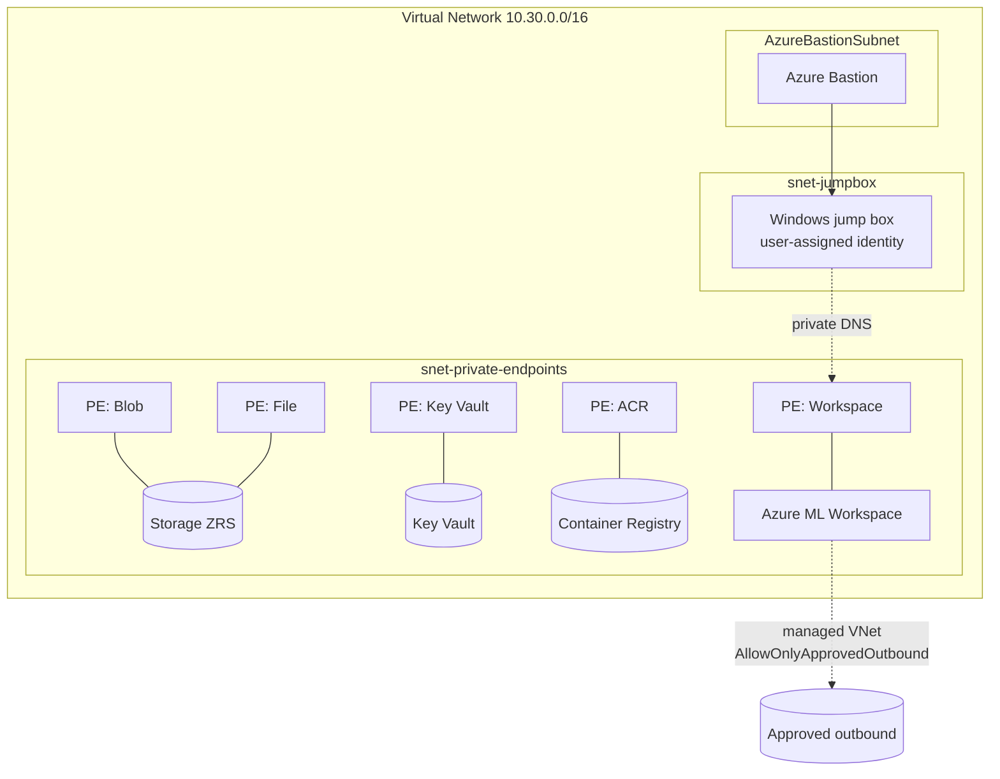

# Terraform — Secure (Managed VNet)

Production-grade Azure Machine Learning workspace with **managed VNet
isolation**, **firewalled** Storage/Key Vault/ACR, **private endpoints** +
**private DNS**, **Azure Bastion**, and an **Entra-joinable Windows jump box**.
Synthetic data only; review the official guidance before production use.

## Architecture



## Resources

- VNet with three subnets (private endpoints, jump box, `AzureBastionSubnet`)
- Private DNS zones + VNet links (blob, file, vault, acr, api, notebooks)
- Storage (ZRS, public access disabled), Key Vault, ACR (Premium) — all
  firewalled with private endpoints
- Application Insights
- Azure ML workspace: `public_network_access_enabled = false`, managed VNet
  `AllowOnlyApprovedOutbound`, system-assigned identity, workspace private
  endpoint
- Azure Bastion + Windows jump box (user-assigned identity with
  `AzureML Data Scientist`)
- Least-privilege role assignment: workspace identity →
  `Storage Blob Data Contributor`

## Deploy

```bash
cp terraform.tfvars.example terraform.tfvars   # edit values
az login
terraform init
terraform plan
terraform apply
```

## Use the jump box (browserless auth)

Connect via Bastion, then on the jump box:

```powershell
az login --identity --username <jumpbox_identity_client_id>
```

This avoids browser-based Conditional Access blocks on non-compliant devices.

## Notes & caveats

- You may also need `Storage File Data Privileged Contributor` for some
  scenarios; add it as a role assignment if job submission requires it.
- Managed VNet `AllowOnlyApprovedOutbound` requires configuring approved
  outbound rules (FQDNs/service tags) for your dependencies. See the
  [managed network guidance](https://learn.microsoft.com/azure/machine-learning/how-to-managed-network).
- These files follow `azurerm` conventions but were not executed in the
  authoring environment (no Terraform binary present). Run
  `terraform init && terraform validate` before applying.

## Clean up

```bash
terraform destroy   # deletes Bastion, jump box, PEs, and all resources
```
